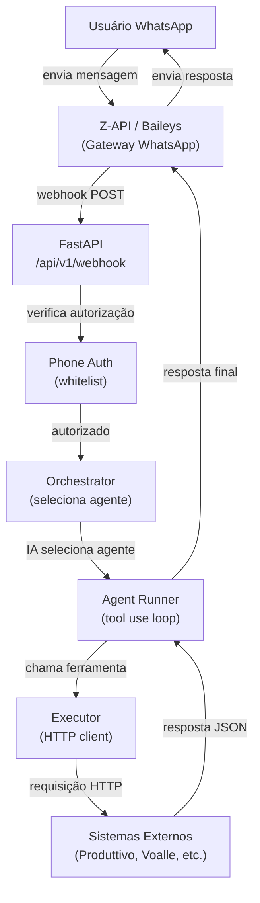
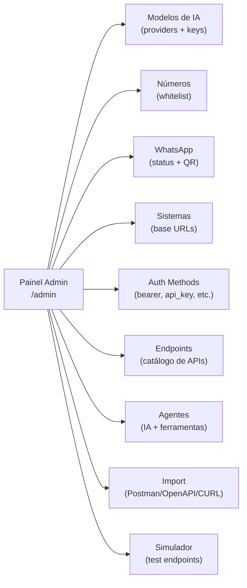

# A Sol da RF — Assistente WhatsApp Inteligente

Backend que transforma o WhatsApp em uma interface de gestão de campo — conectando técnicos, supervisores e operações em tempo real, sem precisar abrir nenhum sistema.

---

## Visão Geral

A RF é uma empresa de serviços de campo. Seus técnicos e supervisores precisam consultar atividades, verificar agendamentos, registrar ocorrências e obter informações operacionais enquanto estão em campo, muitas vezes sem acesso fácil a sistemas desktop.

Este projeto resolve isso com um assistente via WhatsApp: o usuário envia uma mensagem em linguagem natural e o sistema responde com os dados corretos, consultando os sistemas internos nos bastidores — usando agentes de IA com chamadas de ferramenta (tool use) configuráveis via painel admin.

---

## O Problema que Resolvemos

- Técnicos em campo precisam de informações presas em sistemas web
- Supervisores perdem tempo verificando manualmente agendamentos e status
- Não existe interface unificada que fale com todos os sistemas da empresa
- Comunicação via WhatsApp já acontece informalmente — mas sem estrutura

---

## A Solução

Um assistente conversacional no WhatsApp que:

1. **Entende linguagem natural** — o usuário fala como fala normalmente
2. **Despacha para agentes de IA** — cada agente tem endpoints configurados como ferramentas
3. **Consulta os sistemas certos** — Produttivo, Voalle, Telerdar e outros via catálogo de endpoints
4. **Responde de forma clara e direta** — sem menus complicados, respostas curtas para uso em campo
5. **É extensível via painel admin** — novos sistemas e endpoints são adicionados sem código

---

## Fluxo da Aplicação



---

## Painel Admin

Interface web em `/admin` para configurar toda a plataforma sem tocar em código:



---

## Sistemas Integrados

| Sistema | Função | Status |
|---------|--------|--------|
| **Z-API** | Gateway WhatsApp (principal) | Conectado |
| **Baileys** | Gateway WhatsApp alternativo (Node.js) | Conectado |
| **Produttivo** | Gestão de atividades e técnicos de campo | Integrado |
| **Voalle** | (a definir) | Planejado |
| **Telerdar** | (a definir) | Planejado |

---

## Stack Tecnológica

| Componente | Tecnologia |
|------------|------------|
| Linguagem | Python 3.11+ |
| Framework | FastAPI |
| Servidor | Uvicorn |
| HTTP Client | httpx (async) |
| Validação | Pydantic v2 |
| Banco de Dados | PostgreSQL via asyncpg |
| Configuração | pydantic-settings |
| Hospedagem | Render |
| Gateway WhatsApp | Z-API + Baileys (Node.js) |
| Frontend Admin | HTML + CSS + ES Modules (vanilla JS) |

---

## Estrutura do Repositório

```
A_Sol_da_RF/
├── app/                        # Backend Python/FastAPI
│   ├── main.py                 # Entry point — app, CORS, routers, static files
│   ├── config.py               # Settings via pydantic-settings (.env)
│   ├── models/                 # Pydantic data models
│   │   ├── webhook.py          # Z-API e Baileys webhook payloads
│   │   └── ai_model.py         # AI model entity
│   ├── routes/                 # HTTP endpoints (sem lógica de negócio)
│   │   ├── webhook.py          # POST /webhook/zapi e /webhook/baileys
│   │   └── admin.py            # Admin API (9 grupos de endpoints)
│   └── services/               # Lógica de negócio (um arquivo por sistema)
│       ├── database.py         # asyncpg pool + schema SQL
│       ├── orchestrator.py     # Despacha mensagem para o agente correto
│       ├── agent_runner.py     # Executa agente com tool use (multi-turn)
│       ├── executor.py         # Faz requisições HTTP com auth e substituição
│       ├── importer.py         # Importa endpoints de Postman/OpenAPI/CURL
│       ├── ai.py               # Chamadas a modelos de IA (multi-provider)
│       ├── ai_config.py        # CRUD de modelos de IA no banco
│       ├── systems.py          # CRUD de sistemas externos
│       ├── auth_methods.py     # CRUD de métodos de auth
│       ├── endpoints_svc.py    # CRUD de endpoints do catálogo
│       ├── agents_svc.py       # CRUD de agentes + vínculo com endpoints
│       ├── phone_auth.py       # Autorização por número de WhatsApp
│       ├── zapi.py             # Envio de mensagens via Z-API/Baileys
│       └── produttivo.py       # Integração com Produttivo
├── frontend/                   # Painel admin (SPA vanilla JS)
│   ├── index.html              # App shell (v4.0)
│   └── assets/
│       ├── js/
│       │   ├── api.js          # apiFetch helper + token auth
│       │   ├── config.js       # Modelos, Números, WhatsApp
│       │   └── platform.js     # Sistemas, Auth, Endpoints, Agentes, Import, Simulador
│       └── css/
│           └── main.css        # Estilos (dark theme, sidebar, cards)
├── whatsapp-service/           # Serviço Node.js com Baileys
│   └── dist/
│       ├── server.js           # HTTP server para webhook e envio
│       ├── session.js          # Gerenciamento de sessão WhatsApp
│       └── db.js               # Persistência de sessão
├── .env.example                # Template de variáveis de ambiente
├── render.yaml                 # Deploy no Render (2 services + 1 DB)
├── requirements.txt            # Dependências Python
└── docs/                       # Documentação detalhada
    ├── ARCHITECTURE.md         # Arquitetura completa do sistema
    ├── AGENTES.md              # Como funcionam os agentes de IA
    ├── API.md                  # Referência da API admin
    ├── DATA_MODEL.md           # Modelo de dados do banco
    ├── DEVELOPMENT.md          # Guia para desenvolvedores
    └── AI_CONTEXT.md           # Contexto para assistentes de IA
```

---

## Setup Local

```bash
# 1. Clonar o repositório
git clone https://github.com/ricardoarfr/A_Sol_da_RF.git
cd A_Sol_da_RF

# 2. Criar ambiente virtual
python -m venv .venv
source .venv/bin/activate      # Linux/Mac
.venv\Scripts\activate         # Windows

# 3. Instalar dependências
pip install -r requirements.txt

# 4. Configurar variáveis de ambiente
cp .env.example .env
# Editar .env com suas credenciais reais

# 5. Rodar localmente (requer PostgreSQL acessível via DATABASE_URL)
uvicorn app.main:app --reload
```

Acesse o painel admin em: `http://localhost:8000/admin`

Para testar o webhook localmente com o WhatsApp real, use [ngrok](https://ngrok.com):
```bash
ngrok http 8000
# Configure a URL gerada como webhook na Z-API:
# https://<seu-ngrok>.ngrok.io/api/v1/webhook/zapi
```

---

## Deploy no Render

1. Conectar o repositório no [Render](https://render.com) → **New → Blueprint**
2. O `render.yaml` configura automaticamente 2 serviços + 1 banco PostgreSQL
3. Definir as variáveis secretas no painel do Render (ver `.env.example`)
4. Copiar a URL pública gerada e configurar como webhook na Z-API

### Auto-deploy

Todo push para `main` dispara deploy automático no Render.

```
feature branch → PR → merge em main → Render detecta → build + deploy
```

---

## Variáveis de Ambiente

Ver `.env.example` para a lista completa. Variáveis principais:

| Variável | Descrição |
|----------|-----------|
| `DATABASE_URL` | URL PostgreSQL (provida pelo Render) |
| `ADMIN_TOKEN` | Token de acesso ao painel admin |
| `WEBHOOK_SECRET` | Segredo para validar webhooks |
| `ZAPI_INSTANCE_ID` | ID da instância Z-API |
| `ZAPI_TOKEN` | Token Z-API |
| `WHATSAPP_SERVICE_URL` | URL do serviço Baileys (Node.js) |
| `PRODUTTIVO_BASE_URL` | URL base da API Produttivo |
| `PRODUTTIVO_SESSION_COOKIE` | Cookie de sessão Produttivo |

---

## Endpoints Principais da API

| Método | Path | Descrição |
|--------|------|-----------|
| GET | `/health` | Health check (Render) |
| POST | `/api/v1/webhook/zapi` | Webhook Z-API |
| POST | `/api/v1/webhook/baileys` | Webhook Baileys |
| GET | `/api/v1/admin/ai-models` | Listar modelos de IA |
| GET | `/api/v1/admin/systems` | Listar sistemas externos |
| GET | `/api/v1/admin/endpoints` | Listar endpoints do catálogo |
| GET | `/api/v1/admin/agents` | Listar agentes |
| POST | `/api/v1/admin/agents/{id}/run` | Executar agente com mensagem de teste |

Ver [API.md](docs/API.md) para referência completa.

---

## Documentação

| Arquivo | Conteúdo |
|---------|----------|
| [ARCHITECTURE.md](docs/ARCHITECTURE.md) | Arquitetura detalhada e fluxos |
| [AGENTES.md](docs/AGENTES.md) | Como funcionam os agentes de IA |
| [API.md](docs/API.md) | Referência completa da API admin |
| [DATA_MODEL.md](docs/DATA_MODEL.md) | Modelo de dados do banco |
| [DEVELOPMENT.md](docs/DEVELOPMENT.md) | Guia de desenvolvimento |
| [AI_CONTEXT.md](docs/AI_CONTEXT.md) | Contexto para assistentes de IA |
| [ASSISTANT.md](ASSISTANT.md) | Premissas de negócio |
| [CLAUDE.md](CLAUDE.md) | Diretrizes para IA neste projeto |

---

## Roadmap

- [x] Estrutura inicial do projeto
- [x] Webhook Z-API + Baileys funcionais
- [x] Cliente Produttivo (atividades e técnicos)
- [x] Deploy no Render com auto-CI/CD
- [x] Painel admin v4.0 (Modelos, Números, WhatsApp)
- [x] Catálogo de sistemas, auth methods e endpoints
- [x] Agentes com tool use (multi-provider)
- [x] Orquestrador de agentes
- [x] Import de Postman/OpenAPI/CURL
- [x] Simulador de endpoints
- [ ] Integração Voalle
- [ ] Integração Telerdar
- [ ] Histórico de conversas
- [ ] Painel de monitoramento

---

## Contribuindo

Projeto interno da RF. Leia [ASSISTANT.md](ASSISTANT.md) e [CLAUDE.md](CLAUDE.md) antes de propor ou executar qualquer alteração.
