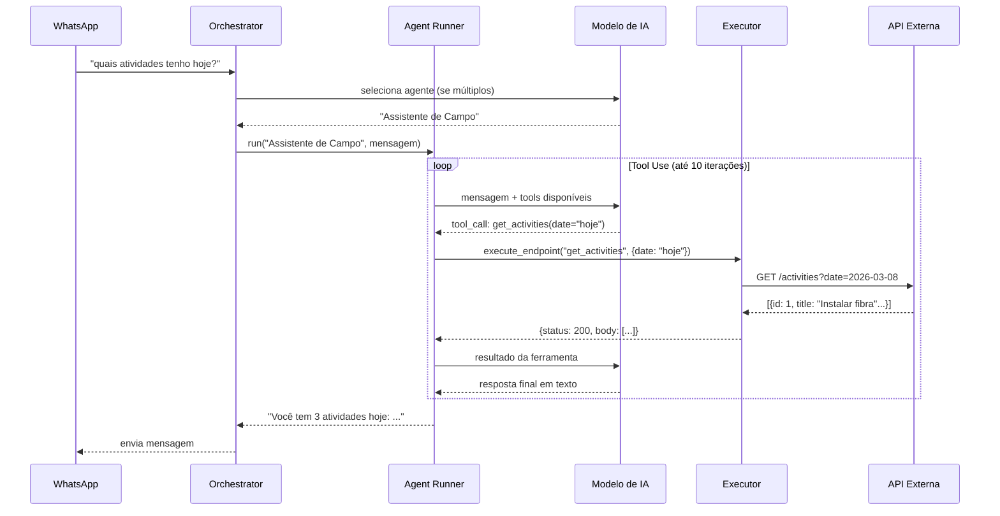

# AGENTES.md — Sistema de Agentes de IA

Documentação completa do sistema de agentes do A Sol da RF.

---

## O que é um Agente

Um **agente** neste sistema é uma combinação de:

1. **Modelo de IA** (qual provider/modelo usa)
2. **System prompt** (como deve se comportar)
3. **Endpoints vinculados** (quais APIs externas pode chamar como ferramentas)
4. **Tipo** (`internal`, `external`, `orchestrator`)

O agente recebe uma mensagem de texto, decide quais ferramentas usar (se houver), executa as chamadas necessárias e retorna uma resposta em linguagem natural.

---

## Tipos de Agentes

### `internal` — Tool Use (padrão)

O agente usa os endpoints vinculados como **ferramentas de IA** (function calling / tool use).

**Fluxo:**
1. Recebe mensagem do usuário
2. Envia para o modelo de IA com a lista de tools disponíveis
3. IA decide quais ferramentas chamar e com quais parâmetros
4. Sistema executa as chamadas HTTP
5. Resultados são devolvidos para a IA
6. IA formula a resposta final em texto

**Quando usar:** Para a maioria dos casos — consultas a sistemas, buscas de dados, ações que dependem de informações do usuário.

### `external` — API Direta

O agente chama uma API externa diretamente, sem loop de tool use.

**Quando usar:** Integrações simples onde o endpoint já retorna a resposta pronta.

### `orchestrator` — Orquestrador

Agente especial que seleciona qual outro agente deve processar a mensagem.

**Quando usar:** Quando o sistema tem múltiplos agentes especializados e precisa rotear automaticamente.

---

## Como os Agentes Interagem



---

## Execução Interna (agent_runner.py)

O módulo `services/agent_runner.py` é o coração do sistema de agentes.

### Função Principal

```python
async def run_agent(agent_id: str, user_message: str) -> str
```

### Algoritmo

```
1. Carregar configuração do agente do banco (system prompt, endpoints vinculados)
2. Para cada endpoint vinculado, criar uma definição de tool:
   - Nome: nome do endpoint (sanitizado)
   - Descrição: description do endpoint
   - Parâmetros: extraídos de {variáveis} no path/body/headers

3. Chamar o modelo de IA:
   - Anthropic: usar formato `tools` nativo
   - OpenAI/Groq/OpenRouter: usar formato `functions`
   - Google: descrever ferramentas no system prompt

4. Loop de tool use (máx 10 iterações):
   a. Receber resposta do modelo
   b. Se é texto final → retornar
   c. Se é chamada de ferramenta:
      - Extrair nome da ferramenta e parâmetros
      - Chamar executor.execute_endpoint()
      - Adicionar resultado na conversa
      - Voltar para (a)

5. Retornar texto final para o WhatsApp
```

### Construção de Tools

Para um endpoint com path `/activities/{date}`, o sistema gera automaticamente:

```json
{
  "name": "get_activities",
  "description": "Lista atividades do dia",
  "parameters": {
    "type": "object",
    "properties": {
      "date": {
        "type": "string",
        "description": "Parâmetro date"
      }
    }
  }
}
```

---

## Orquestrador (orchestrator.py)

O orquestrador decide qual agente processa cada mensagem quando há mais de um agente ativo.

### Lógica de Seleção

```python
async def dispatch(phone: str, user_message: str) -> str:
    agentes_ativos = await buscar_agentes_ativos()

    if len(agentes_ativos) == 0:
        return "Nenhum agente configurado."

    if len(agentes_ativos) == 1:
        return await run_agent(agentes_ativos[0].id, user_message)

    # Múltiplos agentes: usar IA para selecionar
    agente_escolhido = await selecionar_agente_via_ia(agentes_ativos, user_message)
    return await run_agent(agente_escolhido.id, user_message)
```

A seleção por IA usa o **modelo de IA ativo** com um prompt que lista os agentes disponíveis e suas descrições, pedindo ao modelo que escolha o mais adequado para a mensagem.

---

## Executor de Endpoints (executor.py)

Quando um agente decide chamar uma ferramenta, o executor:

### 1. Carrega o Endpoint do Banco

```python
endpoint = await get_endpoint(endpoint_id)
# {method, path, headers, query_params, body_template, auth_method_id, system.base_url}
```

### 2. Substitui Variáveis

```python
# path: /activities/{date} + params: {date: "2026-03-08"}
# → /activities/2026-03-08
url = f"{system.base_url}{substitute(path, params)}"
headers = substitute(endpoint.headers, params)
body = substitute(endpoint.body_template, params)
```

### 3. Aplica Autenticação

```python
match auth_method.type:
    case "bearer":
        headers["Authorization"] = f"Bearer {config['token']}"
    case "api_key":
        if config["location"] == "header":
            headers[config["name"]] = config["value"]
        else:  # query
            query_params[config["name"]] = config["value"]
    case "basic":
        headers["Authorization"] = basic_auth(config["username"], config["password"])
    case "cookie_session":
        headers["Cookie"] = format_cookies(config["cookies"])
    case "custom_header":
        headers.update(config["headers"])
```

### 4. Executa e Retorna

```python
response = await httpx.AsyncClient().request(method, url, headers=headers, ...)
return {
    "status_code": response.status_code,
    "body": response.json(),
    "headers": dict(response.headers),
    "elapsed_ms": response.elapsed.total_seconds() * 1000
}
```

---

## Configurando um Agente no Painel Admin

### Passo a passo

**1. Cadastrar o Sistema**
- Seção: Sistemas
- Nome: "Produttivo"
- Base URL: "https://app.produttivo.com.br"

**2. Configurar Autenticação**
- Seção: Auth Methods
- Nome: "Sessão Produttivo"
- Tipo: cookie_session
- Config: `{"cookies": {"_produttivo_session": "valor-do-cookie"}}`

**3. Criar Endpoints**
- Seção: Endpoints
- Sistema: Produttivo
- Nome: "Listar atividades"
- Método: GET
- Path: `/form_fills?range_time={range}&form_fill[user_ids][]={user_id}`
- Auth: Sessão Produttivo

**4. Criar o Agente**
- Seção: Agentes
- Nome: "Assistente de Campo"
- Tipo: internal
- System Prompt: "Você é um assistente para técnicos de campo da RF. Use as ferramentas para buscar informações do Produttivo. Responda de forma curta e objetiva."
- Ativo: ✓

**5. Vincular Endpoints**
- Após salvar o agente, aparecem as checkboxes de endpoints
- Selecionar: "Listar atividades"
- Clicar: "Salvar vínculos"

**6. Testar**
- Clicar "Testar" no agente
- Digitar: "quais atividades eu tenho hoje?"
- Ver a resposta no painel

---

## Importando Endpoints

Em vez de criar endpoints manualmente, use a seção **Import**:

### Postman Collection

```json
// postman_collection.json
{
  "info": { "name": "Produttivo API" },
  "item": [
    {
      "name": "Listar atividades",
      "request": {
        "method": "GET",
        "url": { "raw": "{{base_url}}/form_fills" },
        "header": [{"key": "Cookie", "value": "{{session}}"}]
      }
    }
  ]
}
```

### OpenAPI / Swagger

Qualquer arquivo `swagger.json` ou `openapi.json` — o importador extrai todos os paths/methods.

### CURL

```bash
curl -X GET "https://app.produttivo.com.br/form_fills?page=1" \
  -H "Cookie: _produttivo_session=abc123" \
  -H "Accept: application/json"
```

---

## Providers de IA e Tool Use

| Provider | Tool Use | Formato | Observações |
|----------|----------|---------|-------------|
| `anthropic` | Nativo | `tools` array | Melhor resultado, iterações mais estáveis |
| `openai` | Function calling | `functions` array | Amplamente suportado |
| `groq` | Function calling | Igual OpenAI | OpenAI-compatible, gratuito |
| `openrouter` | Function calling | Igual OpenAI | Multi-model proxy |
| `google` | Emulado | Descrição no prompt | Ferramentas descritas como texto |

> **Recomendação:** Use Anthropic (`claude-sonnet-4-6`) ou OpenAI (`gpt-4o`) para melhor qualidade de tool use. Groq é boa opção gratuita para testes.

---

## Limites e Comportamento

- **Máximo de iterações:** 10 por mensagem (evita loops infinitos)
- **Timeout da requisição:** 60 segundos (configurado em `api.js` e implícito no httpx)
- **Erros de tool:** Se um endpoint falhar, o erro é passado de volta para a IA, que pode tentar outra abordagem
- **Agente sem endpoints:** Responde apenas com o conhecimento do modelo, sem chamar ferramentas
- **Mensagem longa:** A resposta é enviada como texto único — sem paginação por enquanto
