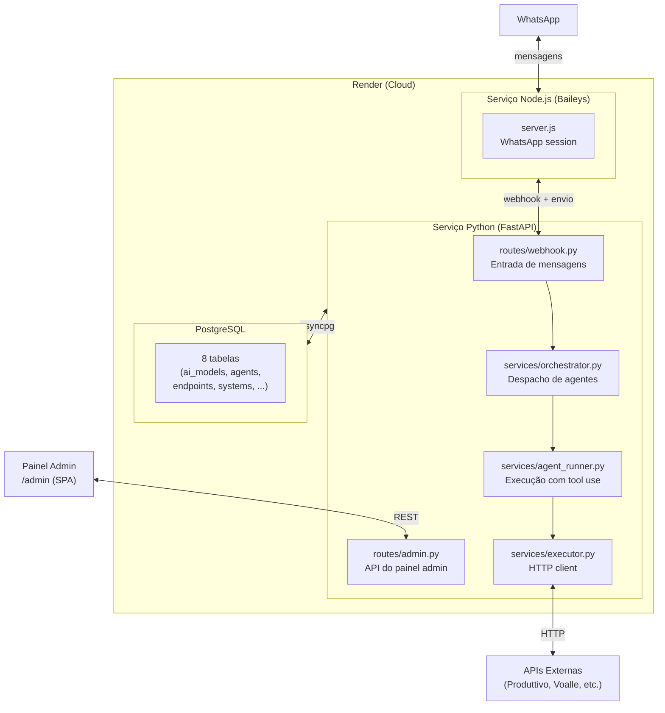

# ARCHITECTURE.md — Arquitetura do Sistema

Documentação técnica detalhada da arquitetura do A Sol da RF.

---

## Visão Geral

O sistema é composto por três processos independentes que se comunicam via HTTP:



---

## Componentes Principais

### 1. FastAPI (Python) — Serviço Principal

O núcleo da aplicação. Responsável por toda a lógica de negócio.

**Entry point:** `app/main.py`
- Cria a aplicação FastAPI com lifespan (inicializa o pool do banco na startup)
- Registra dois routers: `/api/v1/webhook` e `/api/v1/admin`
- Serve o frontend estático em `/admin` via `StaticFiles`
- CORS configurado para permitir todas as origens (uso interno)
- Endpoint `/health` para health check do Render

### 2. Baileys Service (Node.js) — Gateway WhatsApp

Serviço separado que gerencia a sessão WhatsApp usando a biblioteca Baileys.

**Localização:** `whatsapp-service/dist/`
- `server.js`: HTTP server que expõe `/send` (enviar mensagem) e `/status` e `/qr` (status da sessão)
- `session.js`: Gerencia a conexão com o WhatsApp, reconexão automática, persistência de credenciais
- `db.js`: Persiste a sessão no banco PostgreSQL para sobreviver a restarts

O FastAPI se comunica com este serviço via HTTP (URL configurada em `WHATSAPP_SERVICE_URL`).

### 3. PostgreSQL — Banco de Dados

Banco compartilhado entre os dois serviços. O schema é criado automaticamente pelo FastAPI na startup via `services/database.py`.

---

## Camadas da Aplicação

```
┌─────────────────────────────────────────────┐
│                   routes/                    │  ← Recebe HTTP, valida, despacha
├─────────────────────────────────────────────┤
│                  services/                   │  ← Lógica de negócio, integrações
├─────────────────────────────────────────────┤
│                   models/                    │  ← Estruturas de dados Pydantic
├─────────────────────────────────────────────┤
│              database (asyncpg)              │  ← Persistência
└─────────────────────────────────────────────┘
```

**Regra:** `routes/` nunca contém lógica de negócio. Apenas recebe, valida e chama services. `services/` nunca conhece rotas HTTP.

---

## Pipeline de Processamento de Mensagem

Uma mensagem do WhatsApp percorre o seguinte caminho:

```
1. WhatsApp (usuário)
       ↓ envia mensagem
2. Z-API ou Baileys
       ↓ dispara webhook POST
3. routes/webhook.py
       ├─ Valida payload (Pydantic)
       ├─ Ignora mensagens próprias (fromMe)
       └─ Verifica autorização do número
              ↓ se autorizado
4. services/orchestrator.py
       ├─ Carrega agentes ativos do banco
       ├─ Se apenas 1 agente → despacha diretamente
       └─ Se múltiplos → usa IA para selecionar o melhor agente
              ↓
5. services/agent_runner.py
       ├─ Carrega configuração do agente (system prompt, endpoints)
       ├─ Monta tools/functions no formato do provider (Anthropic/OpenAI/etc.)
       ├─ Entra em loop de tool use (até 10 iterações):
       │    ├─ Chama modelo de IA com mensagem + tools disponíveis
       │    ├─ Se IA quer chamar ferramenta → executor.execute_endpoint()
       │    └─ Se IA tem resposta final → sai do loop
       └─ Retorna texto final
              ↓
6. services/executor.py (quando IA chama uma ferramenta)
       ├─ Carrega endpoint do banco
       ├─ Substitui variáveis no path/headers/body ({param} → valor)
       ├─ Aplica autenticação (bearer, api_key, basic, cookies, etc.)
       └─ Executa requisição HTTP via httpx
              ↓
7. routes/webhook.py
       └─ Envia resposta via services/zapi.py → Baileys → WhatsApp
```

---

## Pipeline de Configuração (Painel Admin)

O painel admin permite configurar todo o comportamento do sistema:

```
Admin configura:

Sistemas (ex: "Produttivo")
    └── Auth Methods (ex: "Bearer Token do Produttivo")
        └── Endpoints (ex: "GET /activities/{date}")
            └── Agentes (ex: "Assistente de Campo")
                └── Vincula Endpoints como Tools
                    └── Define System Prompt
                        └── Ativa o Agente
```

Quando uma mensagem chega, o sistema consulta o banco e executa os agentes configurados.

---

## Módulos de Serviço

### Módulos de Infraestrutura

| Módulo | Responsabilidade |
|--------|------------------|
| `database.py` | Pool asyncpg, inicialização do schema, transações |
| `zapi.py` | Envio de mensagens via Baileys/Z-API |
| `phone_auth.py` | Whitelist de números autorizados |

### Módulos de IA

| Módulo | Responsabilidade |
|--------|------------------|
| `ai.py` | Chamadas a modelos (OpenAI, Anthropic, Google, Groq, OpenRouter) |
| `ai_config.py` | CRUD de modelos de IA no banco |
| `orchestrator.py` | Seleção do agente correto para cada mensagem |
| `agent_runner.py` | Execução de agente com tool use loop |

### Módulos de Plataforma

| Módulo | Responsabilidade |
|--------|------------------|
| `systems.py` | CRUD de sistemas externos (Produttivo, Voalle, etc.) |
| `auth_methods.py` | CRUD de métodos de autenticação reutilizáveis |
| `endpoints_svc.py` | CRUD de endpoints do catálogo |
| `agents_svc.py` | CRUD de agentes + vinculação com endpoints |
| `executor.py` | Execução e simulação de requisições HTTP |
| `importer.py` | Importação de endpoints (Postman, OpenAPI, CURL) |

### Módulos de Integração

| Módulo | Responsabilidade |
|--------|------------------|
| `produttivo.py` | Consultas à API do Produttivo (atividades, técnicos) |

> Regra: um arquivo por sistema externo. Voalle, Telerdar etc. terão cada um seu próprio arquivo.

---

## Autenticação

O sistema tem três camadas de autenticação independentes:

### 1. Autorização de Usuários WhatsApp
- Tabela `authorized_phones` com whitelist de números
- Verificação em `services/phone_auth.py` a cada mensagem
- Números normalizados para DDI 55 (padrão brasileiro)
- Lista vazia bloqueia todos os números

### 2. Autenticação do Painel Admin
- Header `X-Admin-Token` em toda requisição admin
- Token configurado via `ADMIN_TOKEN` no `.env`
- Verificação em `routes/admin.py` com dependência FastAPI

### 3. Autenticação de Sistemas Externos
- Configurada via tabela `auth_methods` no banco
- Tipos suportados: `bearer`, `basic`, `api_key`, `oauth`, `custom_header`, `cookie_session`, `reverse_engineering`
- Aplicada dinamicamente pelo `executor.py` antes de cada requisição

---

## Providers de IA Suportados

| Provider | Tool Use | Observações |
|----------|----------|-------------|
| **Anthropic** | Nativo (`tools`) | Melhor suporte para tool use |
| **OpenAI** | Function calling | Padrão da indústria |
| **Groq** | Function calling | OpenAI-compatible |
| **OpenRouter** | Function calling | Multi-model router |
| **Google Gemini** | Sem tools | Ferramentas descritas no system prompt |

A lógica de seleção por provider está em `services/agent_runner.py`.

---

## Substituição de Variáveis

Os endpoints suportam variáveis no formato `{nome_variavel}` em qualquer campo:

```
Path:    /activities/{date}        → /activities/2026-03-08
Headers: {"X-Account": "{acct}"}  → {"X-Account": "123"}
Body:    {"user_id": "{user}"}     → {"user_id": "42"}
```

A substituição é feita por `services/executor.py._substitute()` usando parâmetros fornecidos pelo agente de IA durante o tool use.

---

## Deploy no Render

```yaml
# render.yaml define:
services:
  - name: a-sol-da-rf          # FastAPI Python
    env: python
    buildCommand: pip install -r requirements.txt
    startCommand: uvicorn app.main:app --host 0.0.0.0 --port $PORT

  - name: a-sol-da-rf-whatsapp  # Node.js Baileys
    env: node
    startCommand: node whatsapp-service/dist/server.js

databases:
  - name: a-sol-da-rf-db        # PostgreSQL (free plan)
```

Ambos os serviços compartilham o mesmo banco via `DATABASE_URL`.

---

## Fluxo de Dados no Banco

```
systems (1) ────────────────────────────────── (N) endpoints
auth_methods (1) ────────────────────────────── (N) endpoints
agents (1) ──── agent_endpoints ──── (N) endpoints
ai_models (1) ──────────────────────────────── (N) agents (via ai_model_id)
authorized_phones ── tabela simples, sem FK
```

Ver [DATA_MODEL.md](DATA_MODEL.md) para schema completo.
